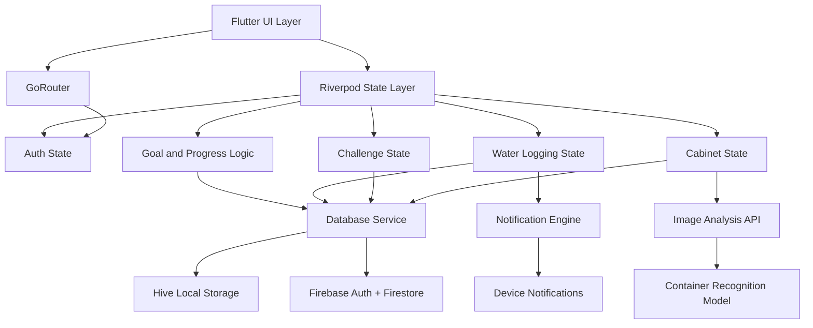
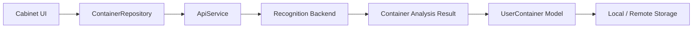
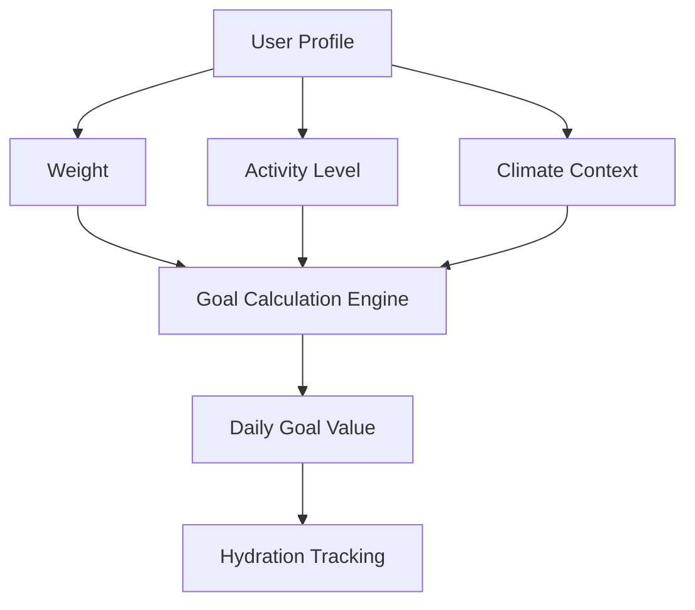
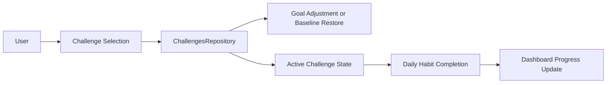
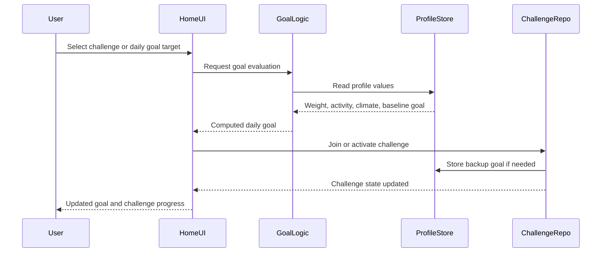
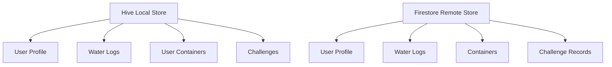
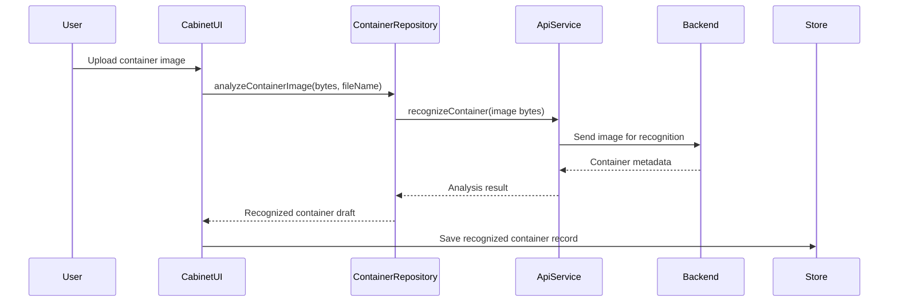
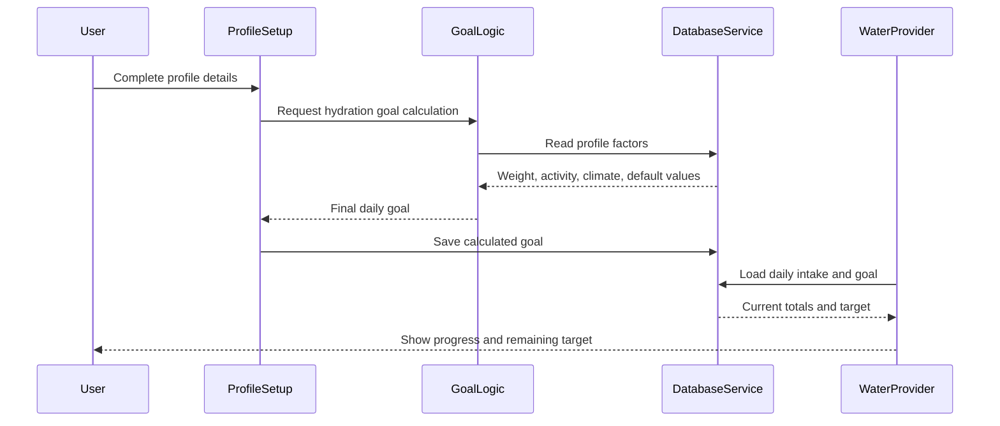
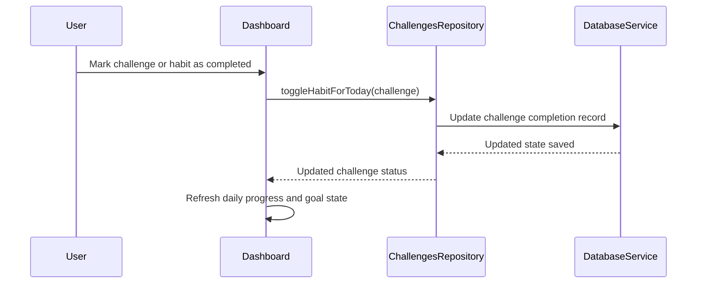

# Chapter 3: System Design and Architecture

## 3.1 Introduction

This chapter presents the system design of BlueDrop, a mobile application developed to support hydration tracking, personalized goal setting, habit-based motivation, and image-driven container recognition. BlueDrop is designed to combine practical health monitoring with intelligent interaction support, enabling users to log daily water intake, track progress against hydration goals, and identify container types through image analysis.

The application architecture is based on a hybrid model that combines local persistence, state-driven UI updates, cloud synchronization, and AI-assisted recognition. Specifically, the system uses Flutter for the mobile front end, Riverpod for state management, GoRouter for navigation, Hive for local persistence, Firebase for authentication and remote storage, and a backend image recognition service for container analysis. This combination supports responsiveness, offline usability, and data continuity in a mobile wellness context.

The purpose of this chapter is to describe the system-level architecture, core functional modules, data flow, and design decisions that underpin the implementation. The discussion is presented in a formal academic style and is aligned with the structure expected in a software engineering dissertation.

---

## 3.2 System Requirements

### 3.2.1 Functional requirements

The BlueDrop application is required to support the following core functions:

- user authentication and profile management;
- onboarding and personalized setup;
- daily hydration logging;
- automatic daily goal calculation using user profile data;
- challenge and habit tracking for motivational engagement;
- image-based container recognition and classification;
- storage and organisation of user container records;
- dashboard reporting of intake progress against target goals;
- analytics of historical hydration trends;
- persistence of user data locally and in the cloud;
- notifications when hydration goals or challenge milestones are met.

### 3.2.2 Non-functional requirements

The system is expected to satisfy the following quality attributes:

- responsiveness: user actions should be reflected immediately within the interface;
- reliability: data should remain available, even in the absence of internet connectivity;
- maintainability: modules should be separated according to responsibility and domain function;
- scalability: the architecture should allow extension with additional features or services;
- usability: core tasks such as logging water or reviewing goals should require minimal effort;
- security: user and health-related data should be protected and restricted to authorized sessions.

---

## 3.3 Design Approach

BlueDrop adopts a hybrid architectural style that is consistent with a MVVM-inspired client design, but also incorporates server-backed services where the application requires remote intelligence, data persistence, or centralized processing. In the Flutter client, the screens and widgets can be interpreted as the View layer, while Riverpod providers and repository-oriented logic act as the state and interaction layer that mediates between the user interface and business functionality. This arrangement creates a clear separation between presentation and application logic and is consistent with the core principles of MVVM-based design.

However, the system is not a pure standalone MVVM application. Several key features depend on external infrastructure. Firebase provides authentication and cloud persistence, while the backend service layer is used for challenge personalization and image analysis. The local-first DatabaseService therefore acts as a coordination layer between the mobile client and these external systems, ensuring that user actions remain responsive even when synchronization is delayed or network connectivity is limited.

This design is motivated by two operational requirements. First, hydration tracking must be immediate and resilient in mobile conditions. Second, more advanced features such as image recognition and challenge personalization require remote computational support. As a result, the system is best described as a hybrid MVVM-style client architecture with a layered service, repository, and persistence model rather than a single-tier or purely server-driven design.

---

## 3.4 Architectural Overview

The BlueDrop architecture is composed of several core subsystems that work together to support the application’s functional requirements. These include the client interface, state management layer, repository/service layer, navigation layer, local persistence layer, cloud data layer, challenge and goal logic, and the image analysis subsystem.

### 3.4.1 Client interface layer

The client interface is implemented in Flutter and contains the screens responsible for user interaction, dashboard presentation, analytics, container recognition, and profile configuration. In MVVM terms, this layer corresponds to the View, where user-facing components render state and transmit user actions to the application logic.

### 3.4.2 State management and ViewModel layer

The application uses Riverpod as the primary state management framework. Riverpod provides a reactive mechanism for managing and propagating state changes throughout the app. In practical terms, the provider layer functions as the ViewModel-equivalent layer, coordinating authentication state, daily goal data, water logging, analytics, and challenge activity.

The principal providers include:

- Auth provider
- WaterLogs provider
- Home provider
- Analytics provider

These providers coordinate the update of local state and trigger UI re-rendering when essential data changes.

### 3.4.3 Repository and service layer

The repository and service layer sits between the UI/state layer and the storage and backend systems. It isolates the application logic from direct data access and network communication. In this design, repositories such as ContainerRepository and ChallengesRepository manage domain-specific operations, while ApiService handles external communication with the backend server for challenge updates and image classification.

This layer is important because it separates user interaction from the operational details of cloud synchronization and AI-based processing. It also allows the system to support caching, asynchronous workflows, and local-first recovery without forcing the UI layer to manage infrastructure concerns.

### 3.4.4 Navigation and flow control layer

GoRouter is used for navigation and route resolution. It manages the transition between public and protected application routes and ensures that users are directed through the required onboarding and setup workflow before being granted access to the main application shell.

This navigation layer provides structural control over the application and supports a secure flow model in which user state and profile completeness influence access.

### 3.4.5 Persistence and synchronization layer

The persistence layer is built around Hive for local storage and Firebase Firestore for remote storage. This separation is important because the application must continue to work even when internet connection is weak or unavailable. Local persistence ensures immediate access to frequently used records, while Firestore acts as the persistent cloud repository for authenticated users.

The DatabaseService class acts as the main persistence coordinator. It is responsible for:

- initialising Hive boxes;
- storing and retrieving local records;
- updating user profile and collection data;
- triggering background cloud synchronization;
- restoring remote data during login or application startup;
- handling migration and sync operations between local and remote stores.

This design reflects a hybrid architecture in which the client retains local autonomy and the server is used selectively for persistence, personalization, and AI-driven functionality.

---

## 3.5 High-Level System Architecture

This diagram presents the major architectural modules of BlueDrop and highlights the central relationship between user interaction, state management, persistence, and the image-analysis subsystem.

---

## 3.6 Cabinet Feature and Image Analysis Subsystem

The cabinet feature represents one of the more distinctive elements of the BlueDrop architecture. It enables the user to store, classify, and manage container information associated with hydration and everyday drink usage. The image analysis component is integrated into this feature to allow users to upload an image of a container and obtain an inferred container specification such as name and volume.

### 3.6.1 Functional purpose

The cabinet subsystem supports the following practical functions:

- upload an image of a container;
- analyse the image using an external recognition service;
- extract container metadata such as name and volume;
- convert the result into a user container model;
- store the inferred item in the local collection and synchronize when appropriate;
- support later retrieval and management of saved containers.

This functionality is important because it closes the gap between real-world objects and the digital water-tracking process. In effect, the system is not limited to recording water intake in abstract terms; it can also reason about physical containers that are used to hold beverages.

### 3.6.2 Image processing flow

The image analysis process is coordinated by the ContainerRepository and ApiService components. The repository receives image bytes and a file name, and then delegates the analysis to the backend recognition endpoint. The response is converted into a model instance representing a container draft or a recognised container record.

### 3.6.3 Design rationale

The cabinet subsystem is designed to separate the user workflow from the underlying recognition process. The interface only needs to initiate the analysis and display the result. The Repository layer handles the data conversion and persistence journey, while the API layer manages the network communication with the recognition service. This separation reduces coupling and keeps the recognition logic modular.

The use of an image recognition service also supports future extension. The platform can be expanded to support more container types, improved recognition confidence scoring, or user confirmation workflows for ambiguous classifications.

---

## 3.7 Goal Calculation and Challenge Logic

A major part of BlueDrop’s behaviour is based on personalised hydration goals and challenge-driven motivation. The system calculates the user’s daily target by considering profile data, such as weight, activity level, and climate. This computed value becomes the user’s baseline hydration goal and is used throughout the home dashboard, activity summaries, and goal tracking features.

### 3.7.1 Default goal behaviour

The system includes default values when a profile has not yet been fully configured. In the implementation, a fallback daily goal value is used when no explicit goal has been stored, and this value is later updated when the user profile is completed. This ensures the application remains operational even before full profile data is available.

### 3.7.2 Personalized goal calculation

The profile setup logic calculates a hydration goal based on physiological and behavioural indicators. The motivation behind this design is that all users do not require the same intake target; factors such as body weight and daily activity strongly influence hydration requirements. The result is a more individualized and medically informed system than a fixed global value.

### 3.7.3 Challenge model

The challenge system is designed to increase motivation by converting routine hydration monitoring into goal-based and habit-based engagement. Challenges are grouped into main goal challenges and side challenges. The main water challenge can temporarily override the user’s daily water goal, while side challenges support habit tracking and completion-based motivation.

The ChallengesRepository class manages the lifecycle of challenges, including activation, completion, and deactivation. When a user joins a challenge, the repository updates the user profile and active challenge state accordingly. When a challenge is left, the system restores the previous baseline goal where relevant.

### 3.7.4 Goal challenge interaction sequence

This sequence highlights the interaction between user profile data, goal calculation, and challenge orchestration. It is a high-level design flow and shows how challenge behaviour is integrated with the user’s hydration target rather than detailing every UI interaction.

---

## 3.8 Data Model and Persistence

The data model of BlueDrop is organised around user-specific information, hydration records, challenge metadata, and recognized containers. The design supports local-first access and eventual synchronization with the remote system.

### 3.8.1 Core data entities

The main entities include:

1. UserProfile
   - name
   - email
   - onboardingCompleted
   - setupCompleted
   - healthConditions
   - climate
   - dailyGoal
   - waterPresets

2. WaterLog
   - id
   - amount
   - drinkType
   - timestamp
   - date
   - userId

3. UserContainer
   - id
   - name
   - volume
   - iconType
   - metadata

4. Challenge
   - id
   - title
   - description
   - type
   - targetVolume
   - status
   - completedDates
   - startDate

The diversity of these entities reflects the two core dimensions of the app: hydration tracking and intelligent support functions.

### 3.8.2 Persistence model

The persistence strategy follows a local-first approach in which user records are kept on the device for immediate access and driven by the current session state. Cloud persistence is used to maintain a consistent user profile across devices and to support future continuity when the app is reopened or re-authenticated.

This layered persistence model supports both short-term responsiveness and long-term durability of user data.

---

## 3.9 System Interaction Flows

### 3.9.1 Container recognition flow

This flow is representative of the intelligent subsystem of the application and demonstrates how image data is translated into a structured digital object for the user’s cabinet.

### 3.9.2 Goal calculation and daily tracking flow

### 3.9.3 Challenge completion and dashboard update flow

These interaction sequences show the higher-order logic of the application rather than low-level routine procedures such as authentication or onboarding screens.

---

## 3.10 Security and Data Privacy

The BlueDrop application processes both personal user information and behavioural health data, and therefore requires a careful approach to privacy and access control. The system uses Firebase Authentication to regulate access to user accounts, while the route-based access model restricts navigation according to user state and setup completion.

The main security considerations include:

- exposure of personal profile data;
- unauthorised access to protected application routes;
- storage of sensitive metadata in local and cloud layers;
- potential leakage of personal data through logs and debug output.

To strengthen the design for future deployment, the application should enforce strict Firestore security rules, validate sensitive profile information at both client and server layers, and reduce the exposure of health-related data in logs and diagnostics.

---

## 3.11 Design Trade-offs and Limitations

The current architecture offers several advantages, but it also introduces a number of trade-offs that should be acknowledged in an academic design discussion.

### 3.11.1 Advantages

- low latency due to local-first persistence;
- resilience when the device is offline;
- clear separation between UI, state, and storage concerns;
- modular integration of image analysis and challenge logic;
- manageable system complexity for a prototype or academic project.

### 3.11.2 Limitations

- the DatabaseService class handles multiple responsibilities, including persistence, synchronization, and local state management;
- conflict resolution for concurrent updates across devices is not fully formalised;
- the architecture is feature-oriented rather than fully domain-driven;
- the image-recognition workflow depends on external service availability and network reliability;
- challenge logic may require further abstraction as the feature set expands.

These limitations are acceptable in a student project context, but they represent areas where a production-grade implementation would require further refinement.

---

## 3.12 Summary

This chapter presented the system design of BlueDrop as a hybrid mobile application architecture that combines local-first data handling, asynchronous cloud synchronization, personalized goal computation, and image-based container recognition. The design reflects the essential needs of the application: responsive hydration tracking, intelligent support for everyday usage, and engaging challenge-driven behaviour.

The cabinet feature and image analysis subsystem extend the application beyond simple logging, allowing the user to interact with physical containers in a meaningful way. Likewise, the goal calculation and challenge logic make the system more adaptive by computing hydration requirements from individual profile data and motivating consistent daily behaviour. The architecture is therefore not just a tracking system, but a behavioural wellness platform whose design is grounded in responsiveness, personalization, and modularity.

In academic terms, the design demonstrates a practical engineering approach that balances functional requirements with reasonable software architecture principles for a mobile health application. It is suitable for a project-based dissertation and provides a strong foundation for future refinement in areas such as repository abstraction, conflict management, and production-level security enforcement.
